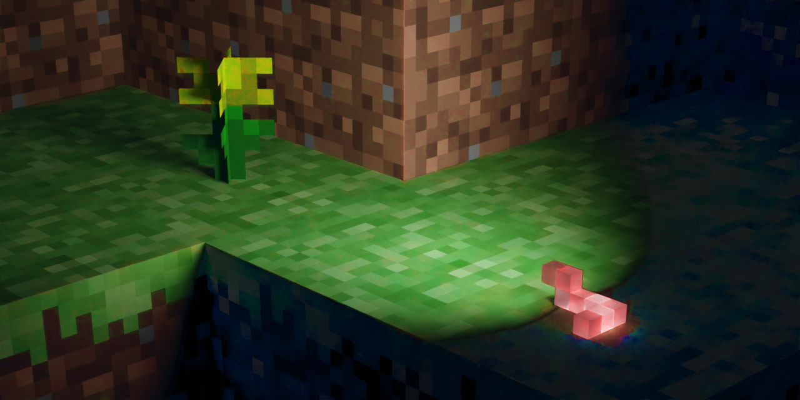

# Worm's Eye View

A simple [BTA](https://www.minecraftforum.net/forums/mapping-and-modding-java-edition/minecraft-mods/3106066-better-than-adventure-for-beta-1-7-3-timely) mod that allows you to enable photo mode shaders outside of photo mode.

